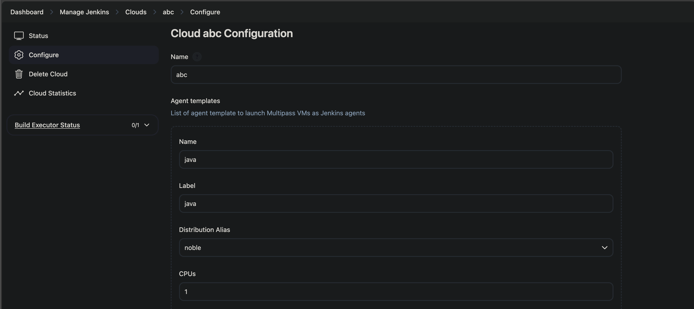

# multipass-cloud

## Introduction

A Jenkins cloud plugin dynamically provisions Multipass VMs as Jenkins agent.

## Getting started

### Screenshots

Figure 1. A Multipass cloud instance


Figure 1.1. Configuration screen for said Multipass cloud instance



Figure 2. Log output from a provisioned node


### Installation

For now, interested folks can utilize
[Plugin ManagerCLI tools for Jenkins](https://github.com/jenkinsci/plugin-installation-manager-tool)
for installation. I'll publish the plugin to Jenkins plugin registry in the
foreseeable future.

```
plugins:    
    - artifactId: multipass-cloud
      source:
        url: https://github.com/hainenber/jenkins-multipass-cloud-plugin/releases/download/0.2.0/multipass-cloud.hpi
```

### Configuration-as-Code setup

You can provision the cloud at startup with Jenkins's
[Configuration as Code plugin](https://github.com/jenkinsci/configuration-as-code-plugin)
. Here's a sample configuration

```
jenkins:
  clouds:
    - multipass:
        name: "multipass"
        templates:
          - name: java-app-builder
            label: "java"
            cpu: 1
            memory: 1G
            disk: 10G
            sshCredentialsId: test-ssh
            cloudInitConfig: |
              #cloud-config
              users:
                - default
                - name: jenkins
              package_update: true
              package_upgrade: true
              packages:
                - git
                - openjdk-21-jre-headless
                - openjdk-21-jdk-headless
```

## Contributing

This project is open for contributions! Right now I don't have a proper
guideline so it's the Wild West here :D

## LICENSE

Licensed under MIT, see [LICENSE](LICENSE.md)
